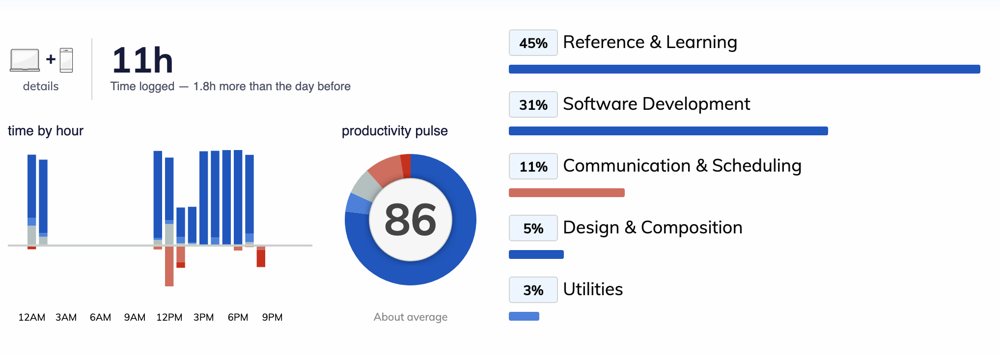

<Text sx={{ fontStyle: `italic`, fontSize: [1]}}>
  As I have mentioned in the last blog, I was planning to write something about my first thought about TDD.
   
  But as I proceed and starting to read more(30+ articles), I realize my understanding of TDD may be too shallow and requires much more readings.
   
  Still, I understand and genuinely like the idea of TDD, but BDD and ATDD sounds much more useful and big step closer to the way how human thinks...)
  Will leave this to the actual TDD post until I dig enough in order to write a self-satisfying blog post.
   
  So - change of plan, I will talk about something else.
</Text>

This blog will be about how I planned to get my AWS association certificate and how I performed so far.

1. Decision of taking the certification exam
2. About the studying plan
3. About about AWS Solutions Architect Certification

## 1. Decision of taking the certification exam
> Why get certified? Why AWS? Why solutions architect?

The reason is simply about gaining more exposure about cloud.
Also, it is another way to force myself to gain more exposures on other some unknown fields.

Well, Azure and Google Cloud are both fine. But I have worked with AWS so I just decided to start with it.

### Associate level - Solutions Architect(SA) vs Developer
There are 3 kinds of certification roles for associate level - _Solutions Architect_ , _Developer_ and _SysOps_

For SysOps, it is about operations and system administration. It is irrelevant from what I have been doing so I just quickly ignored.

I took a deep look into the description between SA and Developer. To simplify:

- *AWS SA* 
  - Designing the best possible architecture in terms of scalability, performance and cost-effectiveness.
- *AWS Developer*
  - get to know tools that AWS prepared for developers
  - in-depth exploration on building CI/CD pipelines

#### The thinking

I gave a quick glance on the AWS Developer materials. 
And I imagine the experience and knowledge about those developer tools and services will be acquired naturally from a company using it.

However, knowing what the existence of infrastructural products and the possibilities of a system architecture are hard to acquired from work.
Besides, the ability to design a scalable and resilient system design then build once myself is something I have been dreamt of.

And this is the reason I picked AWS Solutions Architect. 
But I would consider getting certified for AWS Developers afterwards.

---

## 2. About the study plan

### Initial planned schedule

My initial daily plan on the first day is like:

|         |            |
| ------------- |:-------------:|
| 9am  - 4pm    | Study for AWS |
| 4pm   - 7pm   | Write blogs / coding practices / personal project |

Because I believed that was the most energentic period where human brain functions.

### So on day 3...
I failed to follow the schedule already!  
I found that I was not productive nor efficient as I should. 
And especially it is not like working in a office or with a team. It is hard to stay focus on a single task by myself.

So I just follow with my feeling and do what I feel like, but of course with studying being as my primary focus. 
Generally it is about keeping my brain refreshed by doing something else.

|         |            |
| ------------- |:-------------:|
| 9:30am  - 11am  | Personal project |
| 11am  - 12:30pm | Study for AWS |
 for AWS |
| 12:30pm - 1:30pm | Lunch |
| 1:30pm  - 2pm   | Write some blogs |
| 2pm - 4:30pm    | Study for AWS |
| 4:30pm - 5pm    | Write some blogs / Personal interest project |
| 5pm - 7pm       | Study for AWS |

Well, but of course, for the 3 days before the exam, the schedule looks like:

|         |            |
| ------------- |:-------------:|
| 9:30am  - 11pm  | StudyStudyStudyStudyStudy |

### Some old fashined learning tricks for the modern days
Here are some other tricks that may help.

#### Morning is important - Do not swipe your phone

The philosophy behind is that morning is the most energetic moment of our brain. 
And that is when we are most comfortable and motivated to do something unsatisfying tasks, ie. work and study. 
If I want to stay productive and focused, I will keep thinking about the plan of the day in the morning then execute it later.

You may find yourself not being that productive if you spent some time on social media websites(facebook, instagram, 9gag etc.) after you wake up.
My advice is just leave it until the evening (I even stopped using them these days).

In fact, while I am having breakfast or commuting, I reherse in my head about which website I will first tab on my browser and where have I left off last night.
It's a trick picked up from performing in gigs and job interviews.

Besides, I always keep in mind that
> boredom sparks creativity.
And creativity is not just about art or designs, but also great ideas on solving problems and performing better.

#### Review how you have performed
I happen to come across this [RescueTime](https://www.rescuetime.com/) app and I gave it a shot. 
Then I found it really useful since it shows me the hard fact that how did my plan go.

Here is a screenshot of one of my day.

At first it showed me how I have been distracted by messages, emails, calls and banking statements which gave me a very good hint on what to improve. 
And soon it is satisfying to see how well you have changed and perform better gradually.

The trial version is long enough to try it out properly. 
It cannot track whether you are away or daydreaming, but at least you have not switched too 9gag and endlessly browsing memes. 
I did not subscribe at last because I feel like I have adjusted my schedule during the trial version.

---

## 3. About the certification - like biology
When you first learn biology, you think you know how each part of you body works. 
However, you would gradually be amazed when you are studying that. "Wow! It does that." "I thought I know it."

The same applies to me while studying AWS. 
I have used some of the on-premise hardwares but AWS interpreted the philosophy of why we are having the component with a few more perspective. 
This results in a more terminology to remember. 
With that said, I am just trying to advise you to always assume you don't know about the product.

### Choosing the right course and lecturer that feels right
It's not 80s nor the 90s anymore. 
There are different courses and lecturers we can choose. 
Especially I am using Udemy and they allow user refund their course in 30 days. 
So if you think you don't think you can follow the lecturing speed after an hour or two, just try another one which may make your learning more efficient.
(With that said, I have only refunded a course about TDD as I was trying to look for advanced materials.)

Well I am not saying we should just dump a course that easily. 
But there are different approaches to learn one thing and there are probably better ones that suits you more.

For AWS solutions architect courses, I have bought 2 courses. 
One of them is very exam-focused and one takes care of the exam but also includes practical topics and the professional sharing. 
These sections make me feel like actually learning to be a solutions architect. 
So I picked the latter as the primary courseline to rely on since I want to expose more in solutions architect.

### Keep a pen and papers around you
Solutions architect is about how you form a concrete system design from scratch.
To learn faster, try to first draw a system diagram before proceeding to watch some system architecture instructions.

There are too many choices of services or devices in AWS for you to pick and the abbreviations are very similar, ELB,EBS,ASG...
My understanding about those components reinforced when I was trying to draw that on my paper.
Every single line, I will think and sometimes google to see if they could connect to each other.
Besides I believe this will be something that I am doing in the future.

---

### 3/9 Update: I passed the exam 
#### Quick tips
Don't worry about trying to do a loooot of AWS exam dumps.
For me, the practice exam paper from Udemy works very well. Actually they are more difficult than the exam.  
Oh, but that's not the point. The exam questions and situations keep changiing.  
All you need is to understand how the exam is trying to trick you.  
And those tricks can only be resolved if you read(listen) carefully what the problem is and understand the difference between the AWS components.  
Therefore, before the day of the exam, take a good sleep and use your well rested brain to read through the questions carefully