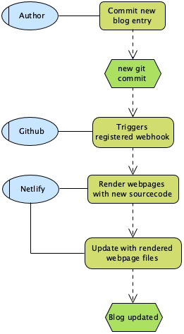

I decided to create my own blog since I now unemployed and trying to do some development work. 

Building this blog took more time as I thought it would be a two days. 
There were too many new options that were new to me and I wanted to take a quick look on most of them as many as possible.

## The decision journey

### Choice of platform

**Frameworks I have first looked at:**
- *Google Blogger* - limited flexibility and third-party themes are mostly outdated
- *Website builder* - expensive subscription and lack of theme choices
- *Wordpress* - great number of themes but always end up hacking and tweaking them. And I have been working with them for long time
- *Medium*
  - I read on Medium, a lot. People write on there is more like publishing their work or astounding thoughts. But I do not want my self concerning too much on how random people see and think what I write. I just want a space where I can customise stuffs and play with cool effects from time to time.

So I gave up on canned solutions to customise my own site and limited down to 2 static site generators - GatsbyJS and Hugo.

**Gatsby - built with React and GraphQL**
- Good chance to practice on React and GraphQL
- Good documentation
- Great numbers of plugins and themes

**Hugo - written in Go**
- Good chance to study Go
- Extreme rendering speed
- No support in JavaScript at all

##### Community

According to some comparison posts, both had the same size community last year. But now the Gatsby community seems to have outreached Hugo’s. 
I have compared the communities of Gatsby and Hugo.

|  | Gatsby | Hugo  |
| -- |-------------|-----|
| **Questions on StackOverflow**  | 3600        | 700         |
| **Issues on Github**            | 11000       | 4800        |

> Here is another good reference - [Live figures](https://www.staticgen.com/)  from Netlify.

##### Support for Javascript

Also, I am more intrigued to add a lot of cool effects into my blog.
There are many interesting effects and useful tools available [here](https://www.gatsbyjs.org/plugins/).

Gatsby becomes the winner base on its extensibility and features. 

*A personal is GraphQL is getting more popular these days. This would be a great place for me to and language. It was hard to understand the concept since I last worked with it but I do want to give another try.*

### Choice of hosting / automated development platform

There are a lot of tools that could automatically render, deploy and host websites from Github.

#### Github Pages and Netlify
For static web development, most people debate on Github Pages and Netlify. 
But Netlify provides friendly drag& drop interfaces, giant data handling and thumbnail generation.

However, the major reason I choose Netlify is purely about experiment.
It is a powerful CI/CD tool allegedly which may widen my vision on gaining visions on more products in the market.

### Other considerations

**Domain name seller**

It’s all about security and price so not much I could mention. And I don’t really worry about my domain getting stolen anyway.

**Domain name of my blog**

I have struggled between `waynehk.dev`, `waynedev.hk` or `waynedev.blog`.
Then, I found the `.me` top-level domain and I just went straight ahead.

- - -

And here is a diagram illustrating the flow of events:

- - -

## Review on the experience
*Since I was a developer evangelist, I am now being sensitive on the learning curve of acquiring a new technology.*

### Gatsby & Shadowing
The learning journey of Gatsby is very satisfying. The tutorial is easy to follow with over-explaining instructions, code blocks and screenshots. 

**Shadowing** is a concept of Gatsby allowing others to make changes on an installed theme - which is similar to class overriding in Java. 
The only thing that comes messy is I have to look for the theme sourcecode and create the exact code path of the file I want to override. 

Other than that, I love how easy a theme or plugin can be twisted.

### Netlify & Netlify CMS
The setup for automated deployment is just a few clicks and granting access on Github which is very smooth and I would recommend this to others.
However, it is not free for multiple accounts.

I probably would add Netlify CMS to create blog entries next.
Actually I have managed to set it up once but messed up to migrate it to my current project. 
But I will just leave it for now and get started on learning some backend tech as I wanted asap.

-----
I think this is a good catchup with React and new web-development technogies.

**Next up** - will be my recent experience with Test-Driven-Technology.
